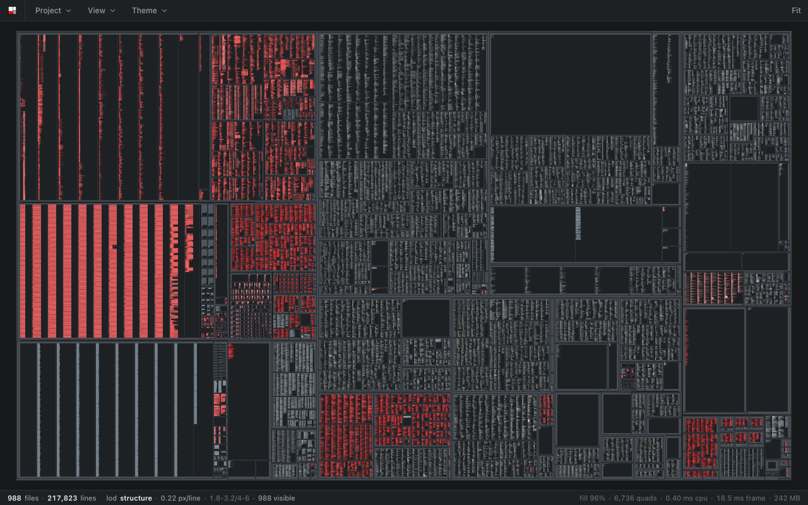
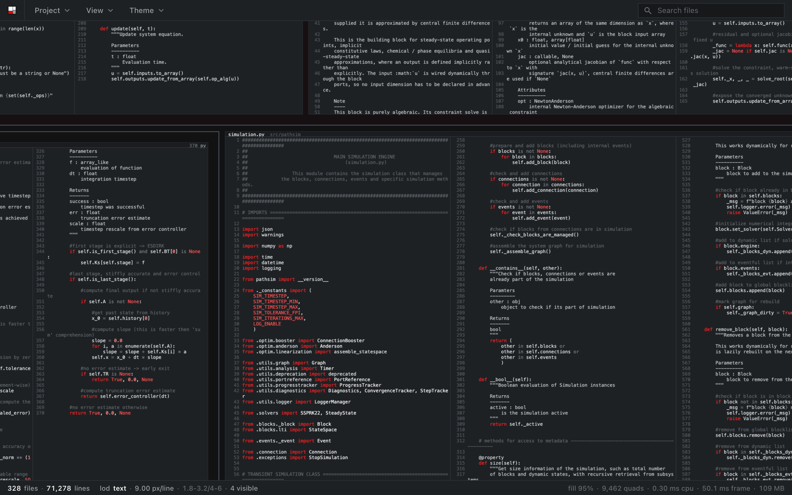

<p align="center">
  
</p>

sanity opens a folder and shows every file in it at once, as read-only panels
on one zoomable canvas, grouped by directory. Zoomed out you see the structure
of the project, zoomed in you read the code. When a file changes on disk, its
panel updates and the changed lines are marked.

It is a monitor. It runs next to the agent interface while coding agents work
in a repository, so you can see which files they touch, where those sit in the
tree, and zoom in to read what changed.

Try it in the browser with a few public repositories, no install:
[sanity.milanrother.com](https://sanity.milanrother.com/)



## Install

[Releases](https://github.com/milanofthe/sanity/releases) have a `.dmg` for
macOS (Intel and Apple Silicon) and an installer for Windows. The builds are
not signed yet. On macOS, right click the app and choose Open the first time.
On Windows, click More info, then Run anyway.

## Usage

```sh
sanity /path/to/repo
```

Or open a folder from the Project menu.

- `f` fits the whole project, a double click fits a panel.
- `/` jumps to search, over file names and contents. Enter goes to the next
  hit, Escape clears.
- Clicking a panel header opens the file in `$SANITY_EDITOR`, `$VISUAL`,
  `$EDITOR` or the system default.
- Right click exports the view or the whole project as a 4K PNG.
- The View menu sets which file types are shown, whether files ignored by git
  are listed, and whether files are coloured by language. The Theme menu has
  eight themes.

## What it shows

- Source files with syntax highlighting for 16 languages (tree-sitter), plus
  Verilog-A and SPICE.
- Jupyter notebooks as their cells rather than as JSON.
- Images, SVGs and the first page of PDFs as panels in their own proportions.
  PDF pages are rendered on macOS only for now.
- Files ignored by git are left out, or listed as placeholders if you switch
  them on.

It draws only when something changes, so it uses no CPU while idle, and it
stays usable up to around 100,000 files.



## Building

```sh
npm ci && npm ci --prefix web
npm run app            # development build
npm run app:build      # release bundle
```

The web demo is the same app reading pre-built dumps of public repositories
over HTTP:

```sh
npm run demo           # clone and dump the demo repositories
npm run dev            # http://localhost:5183
```

## Checks

```sh
npm run check-all
```

Type checks, clippy, the TypeScript and Rust tests, and a set of scripts in
`web/scripts` that open the app in a real browser and check what it draws:
layout, text, pictures, performance, themes and more.

## Repository

```
crates/sanity-core     scanning, tokenising, the wire format
src-tauri              the desktop shell and file watcher
web/src/lib/canvas     layout and the WebGL2 renderer
web/src/lib/ui         interface components
web/scripts            browser checks
```

Design decisions and measurements are in the
[issues](https://github.com/milanofthe/sanity/issues).

## Licence

MIT, see [LICENSE](LICENSE).
