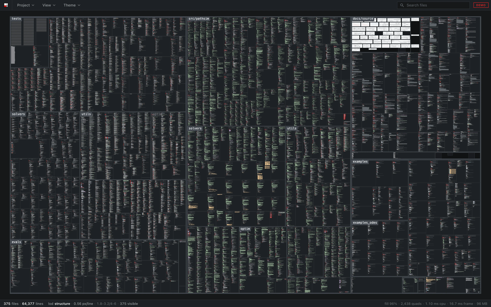
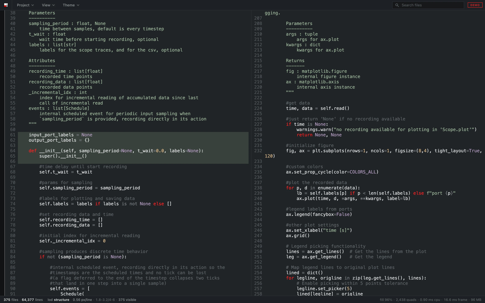
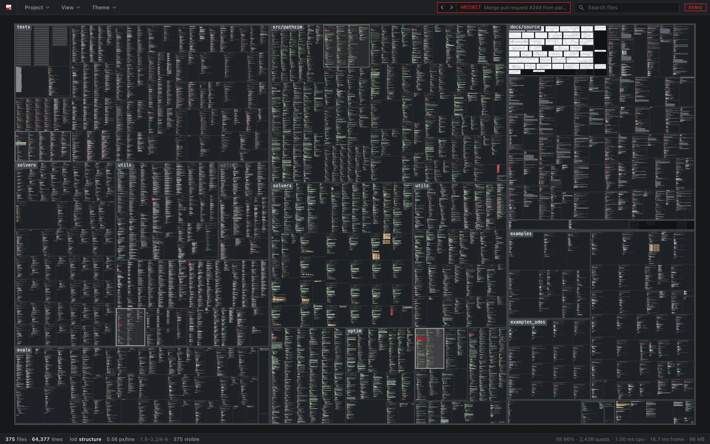
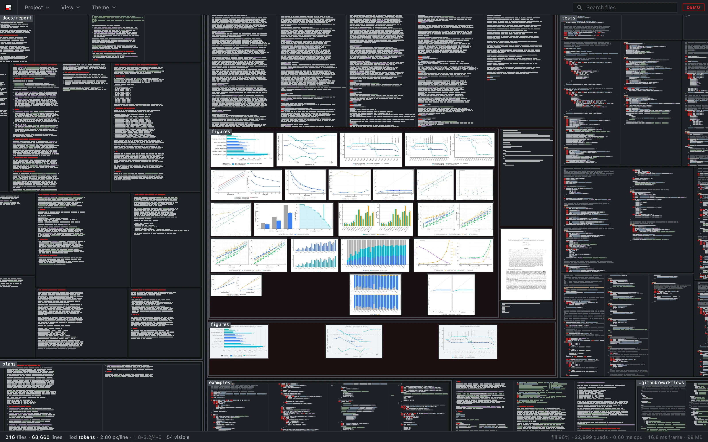
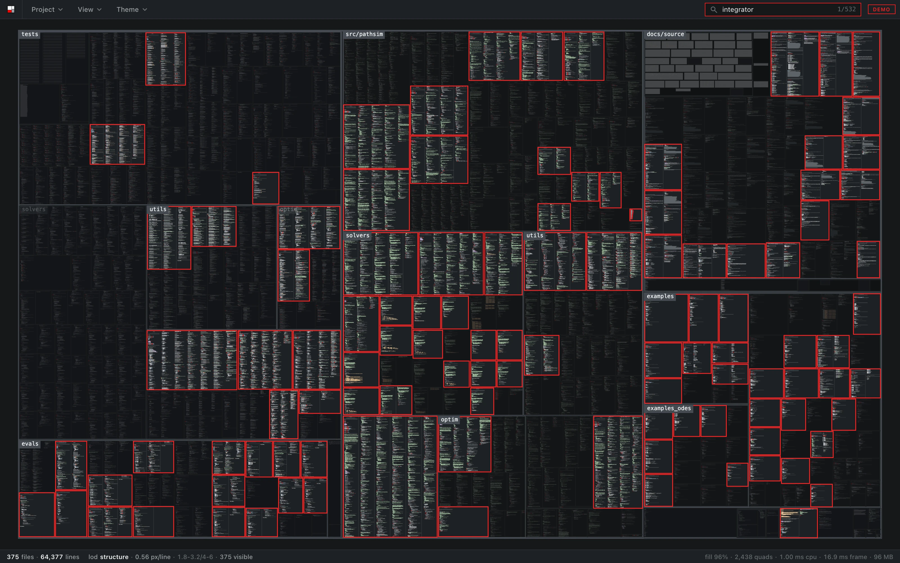

<p align="center">
  
</p>

sanity opens a folder and shows every file in it at once, as read-only panels
on one zoomable canvas, grouped by directory. Zoomed out you see the structure
of the project, zoomed in you read the code. When a file changes on disk, its
panel flashes and the changed lines are marked.

It is a monitor. It runs next to the agent interface while coding agents work
in a repository, so you can see which files they touch, where those sit in the
tree, and zoom in to read what changed. It also plays the repository's git
history the same way, one commit at a time.

Try it in the browser with a few public repositories, no install:
[sanity.milanrother.com](https://sanity.milanrother.com/)



## Install

[Releases](https://github.com/milanofthe/sanity/releases) have a `.dmg` for
macOS (Intel and Apple Silicon) and an installer for Windows. The builds are
not signed yet. On macOS, right click the app and choose Open the first time.
On Windows, click More info, then Run anyway.

## Usage

```sh
sanity /path/to/repo
```

Or open a folder from the Project menu.

- Space or `f` fits the whole project, a double click fits a panel.
- `/` jumps to search, over file names and contents. Enter goes to the next
  hit, Escape clears.
- The left and right arrow keys, or `[` and `]`, step through the git history.
- Clicking a panel header opens the file in `$SANITY_EDITOR`, `$VISUAL`,
  `$EDITOR` or the system default.
- Right click exports the view or the whole project as a 4K PNG.
- The View menu sets which file types are shown, whether files ignored by git
  are listed, whether files are coloured by language, whether directories are
  named over the canvas, whether documents show all their pages, and whether
  each step through the history fits the whole project. The Theme menu has eight
  themes.

## Watching changes

The folder is watched while it is open. When a file is saved, its panel
flashes, the lines that were removed flash red and disappear, and the lines
that were added come in green. A new file fades in where the layout puts it,
and a deleted one fades out in red. When several files change at once, a
commit, a formatter or a save of all open files, they start one after another
across the canvas, so you can follow where it went.

The bands are drawn at every zoom level, so even with the whole project on
screen you can see where in a file the change was. A file that is rewritten
with the same content, by `touch` or a formatter with nothing to do, does not
flash. Moving or renaming a directory is picked up as its files moving.



## History

In a git repository a ticker appears next to the search field. Its arrows, the
arrow keys, or `[` and `]`, step through the commits, newest first. Each step is played like
a save: the lines the commit removed flash red, the ones it added flash green,
files it deleted fade out and files it created fade in. Stepping back plays
the same commit in reverse. Clicking the commit id returns to the present.

Right click, Export history, renders the replay to an MP4: from the oldest
commit to the newest in the length you set, several commits a step when there
are more than fit, with each commit's date, id and subject along the bottom.

Each commit is laid out for the files it has, so there are no empty places
for files that come later or went earlier. When a step adds or removes files,
the panels slide to their new places, and by default the view fits the whole
project again. The working tree is never touched; the contents come out of
git's object store, and the watcher keeps running in the background, so
returning to the present shows the folder as it is.



## What it shows

- Source files with syntax highlighting for 16 languages (tree-sitter), plus
  Verilog-A and SPICE.
- Jupyter notebooks as their cells rather than as JSON.
- Images, SVGs and PDFs as panels in their own proportions. A PDF shows its
  first page, or all of its pages with Expand documents in the View menu,
  rendered the same way on every platform.
- Files ignored by git are left out, or listed as placeholders if you switch
  them on.

It draws only when something changes, so it uses no CPU while idle, and it
stays usable up to around 100,000 files.



Search covers file names and the text of every file. Matching panels stay lit,
the rest dims, matching lines are banded, and Enter walks through the hits.



## Building

```sh
npm ci && npm ci --prefix web
npm run app            # development build
npm run app:build      # release bundle
```

The web demo is the same app reading pre-built dumps of public repositories
over HTTP:

```sh
npm run demo           # clone and dump the demo repositories
npm run dev            # http://localhost:5183
```

The pictures in this README are made by `npm run readme-shots`, against the
dev server.

## Checks

```sh
npm run check-all
```

Type checks, clippy, the TypeScript and Rust tests, and a set of scripts in
`web/scripts` that open the app in a real browser and check what it draws:
layout, text, pictures, change cues, performance, themes and more.

## Repository

```
crates/sanity-core     scanning, tokenising, git history, the wire format
crates/sanity-watch    watching the folder, debounced into batches
src-tauri              the desktop shell
web/src/lib/canvas     layout and the WebGL2 renderer
web/src/lib/ui         interface components
web/scripts            browser checks and the README pictures
```

Design decisions and measurements are in the
[issues](https://github.com/milanofthe/sanity/issues).

## Licence

MIT, see [LICENSE](LICENSE).
